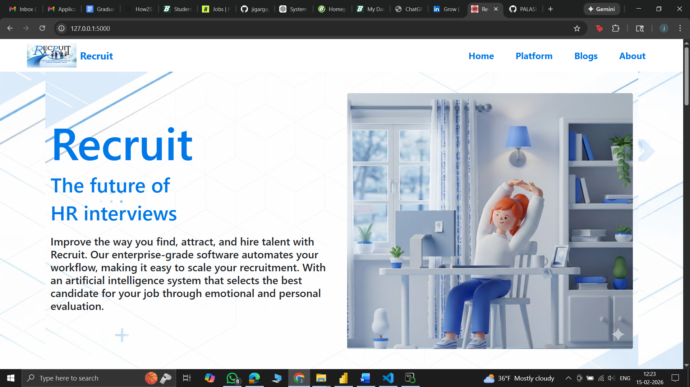
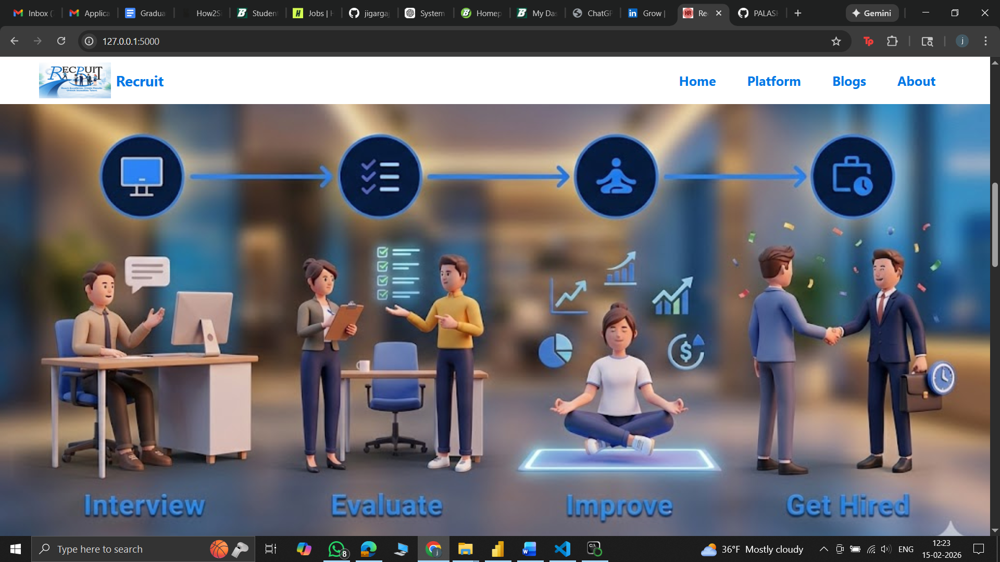
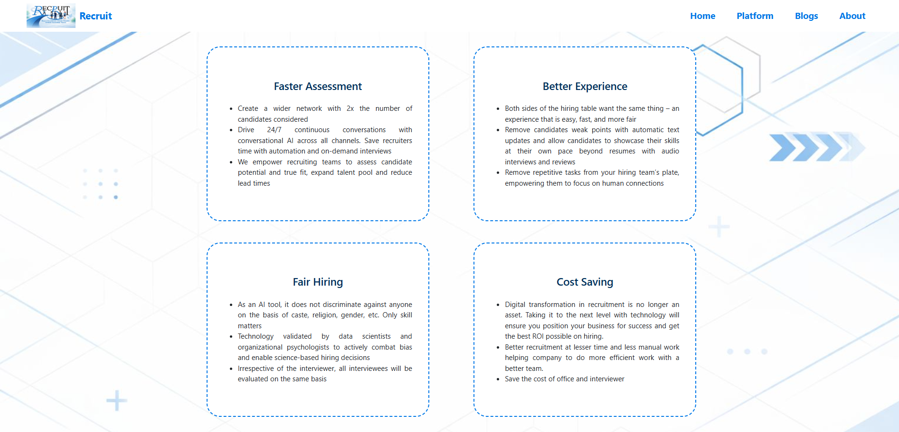
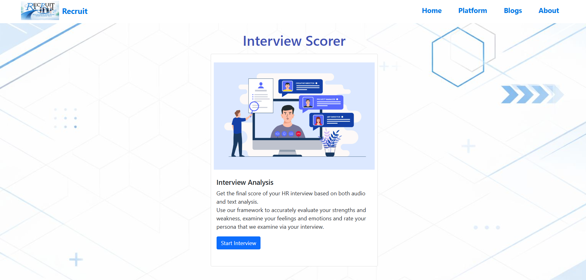
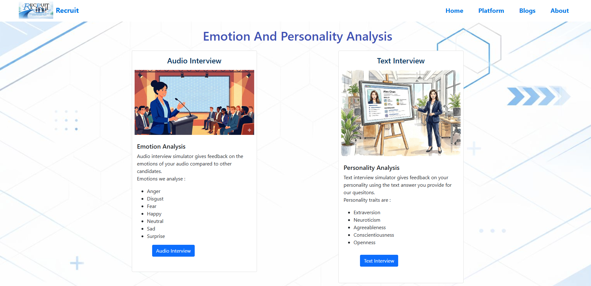
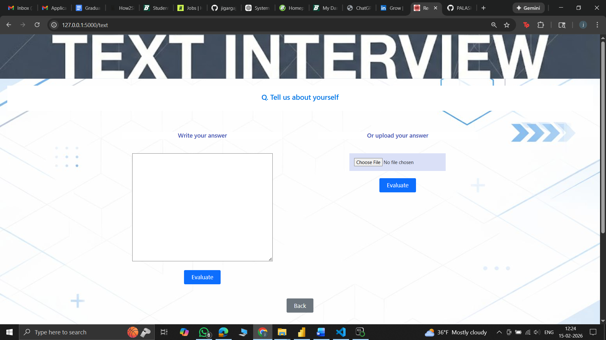
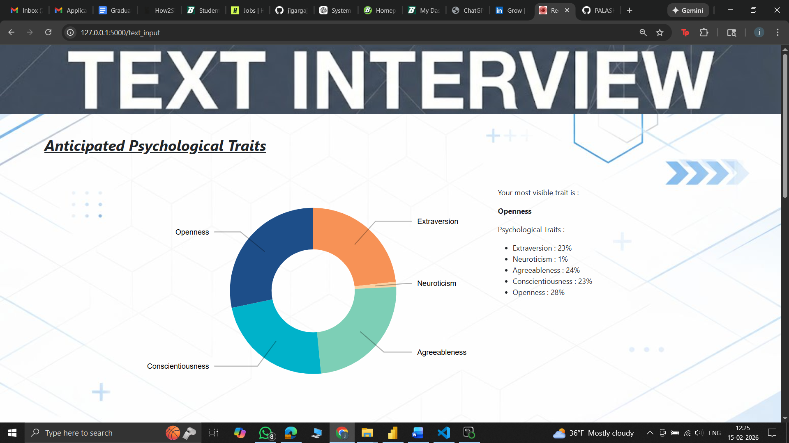
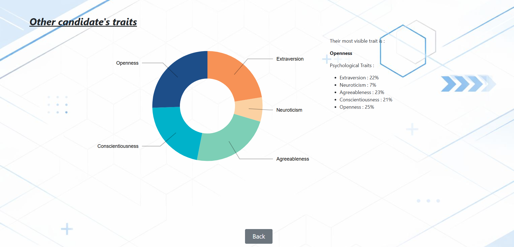

# Recruit — AI Powered Automated Interview Analysis Platform

Recruit is an AI-driven automated interview analysis web application designed to evaluate candidate responses using multi-modal machine learning techniques including audio emotion recognition and interview response analytics.

This project is built using Flask for backend web services, integrated with machine learning models for speech-based emotion detection and interview performance scoring, and a responsive frontend for real-time user interaction and visualization.

---

## Project Overview

Recruit enables automated candidate interview evaluation by analyzing:

• Audio-based emotional signals  
• Interview response patterns  
• Performance scoring and visualization dashboards  

The platform is designed to simulate real interview workflows while providing analytical insights into candidate communication and emotional confidence.

---

## Key Features

- Automated Audio Interview Recording
- Speech Emotion Recognition using Deep Learning
- Interview Performance Scoring
- Real-time Dashboard Visualization (Chart.js)
- Flask-based Full Stack Web Application
- Structured Candidate Evaluation Workflow
- Modular ML + Web Architecture  

---

## Tech Stack

### Backend
- Python
- Flask

### Machine Learning
- TensorFlow / Keras
- Librosa (Audio Feature Extraction)
- NumPy / SciPy
- Speech Emotion Recognition Models

### Frontend
- HTML5
- CSS3
- Bootstrap
- JavaScript
- Chart.js (Data Visualization)

## Application Screenshots

### Home Page





### Audio Interview Page






### Analysis Dashboard




---


---

## Installation & Setup

### 1) Clone Repository
```
git clone https://github.com/Jayanth717/HiRe_Automated_Interviewing_tool.git
cd HiRe_Automated_Interviewing_tool
```
### 2) Create Environment
```
conda create -n recruit python=3.10
conda activate recruit
```
### 3) Install Dependencies
```
pip install -r requirements.txt
```
### 4) Run Appliation 
```
python app.py
```
## Use Cases

• Automated HR Screening
• Interview Training & Simulation
• Behavioral Communication Analysis
• Candidate Soft Skill Assessment

## Future Improvements

• Multi-modal video + audio fusion
• LLM-based answer semantic scoring
• Bias reduction in emotion detection
• Cloud deployment (AWS / Azure / GCP)
• Real-time recruiter dashboard

## Credits & Acknowledgement

This project is derived and significantly enhanced from the original project:

HiRe — Automated Interviewing Tool
Original Author: Palash Bajpai
Original Repository:
👉 https://github.com/PALASH-BAJPAI/HiRe_Automated_Interviewing_tool

##  Enhancements in Recruit include:
- UI/UX redesign and branding update
- Improved ML integration and pipeline structure
- Updated web architecture and modularization
- Additional analytics and visualization components
- Performance and usability improvements

# Author
Jayanth Kumar

